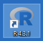
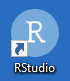
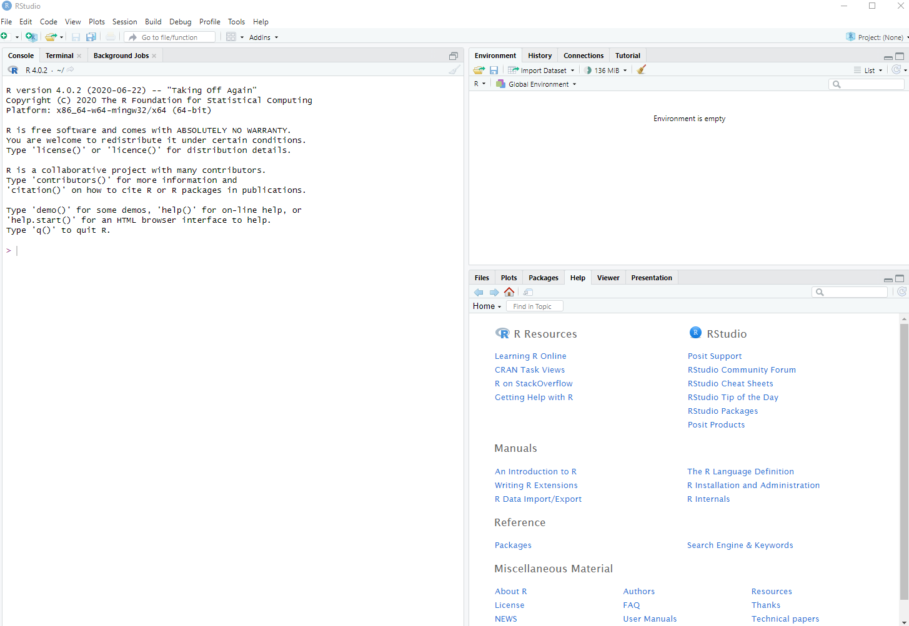

# Introduction to R for Air Quality Data Science

This repository provides a comprehensive series of lessons aimed at introducing R programming for air quality data science. Whether you're a beginner in R or looking to expand your data science skills into the environmental sector, these tutorials will guide you through the essential aspects of R programming, including data manipulation, visualization, and statistical analysis.

## Lessons Overview

1. **Introduction to R**
   - Basics of R programming
   - Understanding R syntax and operations

2. **Functions and Importing Data**
   - Using built-in and package functions
   - Importing data from various sources
   - Data manipulation and cleaning

3. **Subsetting, Sorting, and Combining Data Frames**
   - Techniques for subsetting data
   - Sorting and combining datasets
   - Handling and transforming data

4. **Writing Functions, Conditionals, and Loops**
   - Creating custom functions
   - Utilizing conditionals (`if`, `ifelse`) for data analysis
   - Iterating with loops and apply functions

5. **Plotting in R**
   - Introduction to base plotting functions
   - Advanced visualization with `ggplot2`
   - Creating scatter plots, line graphs, histograms, and box plots

6. **Basic Statistics**
   - Descriptive statistics
   - Statistical tests (t-test, Shapiro-Wilk test)
   - Correlation analysis

7. **Quality Assurance and Common Pitfalls**
   - Ensuring data integrity
   - Handling outliers and unallowed values
   - Avoiding common mistakes in R programming

## Getting Started

Before diving into the lessons, ensure you have R and RStudio installed on your machine (see below). Each lesson includes practical exercises designed to reinforce the concepts covered. We recommend following the lessons in order to build a solid foundation in R programming for air quality data science.

## Install R and RStudio

This section covers the two pieces of software you need to download. R is the core software that must be installed. RStudio is a nice
integrated development environment (IDE) that makes it much easier to use R.

To download R, [see this page](https://cran.r-project.org/). You will need to select the version that is compatible with your operating
system (PC or Mac). Accept the default options during the installation.

Once you have installed R, you can open the program itself. On PC, if you have selected the desktop shortcut during installation, the R icon
will look like this:

Once opened, the R console looks very plain.

RStudio makes R much more user friendly. It's free and can be downloaded from the [Posit website](https://posit.co/download/rstudio-desktop/).
Accept the defaults during installation. It's not necessary to open RStudio to use R, but in these sessions we will assume that RStudio is your
interface to R.

On a PC, the RStudio desktop icon looks like this:

When you first open RStudio, this is what you see:

The left panel is the console for R. Type `1 + 1` in the console then hit "Enter" and R will return the answer.

It's a good idea to use a script so you can save your code. Open a new script by selecting "File" -> "New File" -> "R Script" and it will appear
in the top left panel of RStudio.

This is a text document that can be saved. Go to "File" -> "Save As" and you can save the file with a `.R` extension. You can type and run more
than one line at a time by highlighting and clicking the "Run" button on the script tool bar.

The bottom right panel can be used to find and open files, view plots, load packages, and look at help pages. The top right panel gives you information
about what variables you're working with during your R session.

## View Content on Github

You can view the first lesson here: [Introduction to R](./docs/1-Introduction-to-R). Each lesson is contained in a separate folder and includes a README file with detailed instructions and code examples.

## Contributing

We welcome contributions to improve the lessons or add new content relevant to air quality data science. If you have suggestions or corrections, please feel free to open an issue or a pull request.

## License

This educational content is provided under a [MIT License](LICENSE). Feel free to use, share, and adapt these materials for your learning or teaching needs.

Happy learning!

