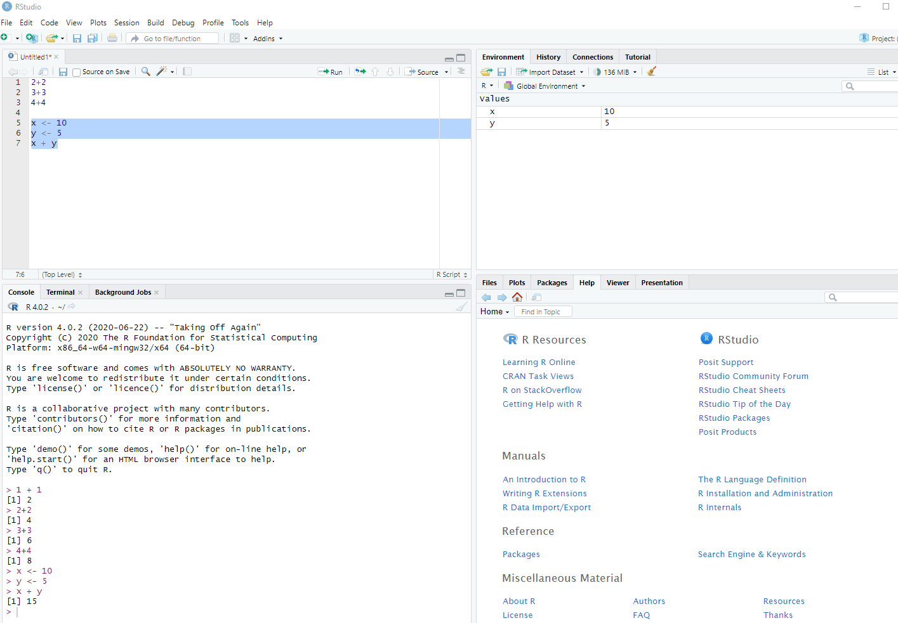

# Introduction to R 

This lesson is a part of the Introduction to R for Air Quality Data Science. The sections below provide a basic introduction to R, including how to install and set up R and RStudio, an overview of R syntax, and how to perform simple operations.
 

- [What is R?](#what-is-r)

- [Why Use a Programming Language?](#why-use-a-programming-language)

- [Install R and RStudio](#install-r-and-rstudio)

- [Basic Math](#basic-math)
  - [Order of Operations](#order-of-operations)

- [Note on Comments and Code Blocks](#note-on-comments-and-code-blocks)

- [Variables](#variables)

- [Data Types](#data-types)

- [Grouping Data](#grouping-data)
  - [Vectors](#vectors)

  - [Lists](#lists)

  - [Data Frames](#data-frames)

- [Further Reading](#further-reading)

## What is R?

R is a free, open-source computing language. It was originally written by statisticians for doing statistical analysis in academia. In recent years it has become more widely used in many industries for performing a variety of data science tasks such as:


## Why Use a Programming Language?

R is one of several programming languages that can be used for data science, including [Python](https://www.python.org/) and
[Julia](https://julialang.org/). They each have advantages and disadvantages, but they are all powerful tools for data science.
These [high-level languages](https://en.wikipedia.org/wiki/High-level_programming_language) give you access to modern algorithms
for processing large amounts of data in a few lines of code.


Many data analysis tasks can be accomplished with spreadsheets and other business intelligence (BI) tools such as Looker and Power
BI. When should you move beyond BI tools and use a high-level programming language like R? Below are a few scenarios where a language
like R is more advantageous than a BI tool.


## Basic Math

Open up a script if you haven't already (“File” -> “New File” -> “R Script”). Try some math by either typing the lines below or copying and pasting
the lines into your script.


```{r ex-vjQcW-1, exercise = FALSE, eval = TRUE, exercise.cap = 'Practice Basic Math Operations'}
10 + 5
10 - 5
10 * 5
10 / 5
10 ^ 5

```

Remember, to run the lines, highlight your code and click the "Run" button on the toolbar of the script panel. Below is a table of the math operators
in the R language.


| Operator | Meaning | Example |
| --- | --- | --- |
| + | addition | 2 + 2 |
| - | subtraction | 2 - 2 |
| * | multiplication | 2 * 2 |
| / | division | 2 / 2 |
| ^ | exponentiation | 2 ^ 2 |

### Order of Operations

R follows the usual order of arithmetical operations and uses parentheses for grouping operations. Run the two lines of code below and you can
see the different values that are returned.


```{r ex-gvRru-1, exercise = TRUE, exercise.eval = FALSE, exercise.cap = 'Understanding Order of Operations'}
10 - 3 / 5

```

```{r ex-FXTmd-2, exercise = TRUE, exercise.eval = FALSE, exercise.cap = 'Practicing Grouping with Parentheses'}
(10 - 3) / 5

```

## Note on Comments and Code Blocks

To write a comment in your script that will not be evaluated, type `#` in front of your comment. The text after `#` will not be evaluated. There is
no multi-line commenting in R, so every comment line must begin with the `#` character.


Run all of the code below and see what gets returned in the R console (bottom left panel in RStudio).


```{r ex-l1Nhp-1, exercise = TRUE, exercise.eval = FALSE, exercise.cap = 'Experiment with Comments'}
# Full line comment
5^2 # partial line comment

```

In the example above and the previous section, you have seen the R code and its output. The code blocks with output look like this, with `1+1` being
the R code and `## [1] 2` being the output:


```{r ex-j5jxf-2, exercise = TRUE, exercise.eval = FALSE, exercise.cap = 'Code and Output Example'}
1+1

```

However, in the R console the code and output would look like this:


```{r ex-PxytK-3, exercise = TRUE, exercise.eval = FALSE, exercise.cap = 'Console Code Execution'}
1 + 1

```

## Variables

A variable is a letter or combination of alphanumeric characters that is used to store data. To create a variable in R, use the less-than character
with the dash to create an arrow symbol pointing left `<-`. Below, the variables `x` and `y` are created by assigning some numbers to them.


```{r ex-ljYZM-1, exercise = TRUE, exercise.eval = FALSE, exercise.cap = 'Creating Variables'}
x <- 10
y <- 5
x + y

```

In RStudio, you will see the variables we created in the top right panel.




If you've already created a variable, you can replace the value with another value.


```{r ex-1q7Z9-2, exercise = TRUE, exercise.eval = FALSE, exercise.cap = 'Exploring Variable Assignment'}
x

```

```{r ex-aDsxE-3, exercise = TRUE, exercise.eval = FALSE, exercise.cap = 'Updating Variable Values'}
x <- 20
x

```

In the top right panel you can see that the number stored in the variable `x` has changed.


There are 3 important rules to remember when creating variable names:


Try running the following code and you will see that in your global environment there are two different objects listed.


```{r ex-VKF12-4, exercise = TRUE, exercise.eval = FALSE, exercise.cap = 'Variable Naming Rules'}
x <- 5
X <- 5

```

## Data Types

R has three main data types:


| Type | Description | Examples |
| --- | --- | --- |
| character | letters and words | `z`, `red`, `H2O` |
| numeric | numbers | `1`, `3.14`, `log(10)` |
| logical | binary | `TRUE`, `FALSE` |

The `character` type requires single or double quotes. The logical values
`TRUE` and `FALSE` should not be quoted and require full caps.


## Grouping Data

There are several ways to group data to make them easier to work with:


### Vectors

A vector variable can contain only one type of data (numeric, character, or logical). We use `c()` to create vectors.


```{r ex-dpBsk-1, exercise = TRUE, exercise.eval = FALSE, exercise.cap = 'Creating Numeric Vectors'}
x <- c(1, 2, 3, 4, 5)
x

```

```{r ex-c7H5v-2, exercise = TRUE, exercise.eval = FALSE, exercise.cap = 'Creating Character Vectors'}
fruit <- c("apples", "bananas", "oranges")
fruit

```

If you try to type in text without using quotations marks for character values (either single or double quotes), then R will throw an error. Try
running the code below.


```{r ex-ypurf-3, exercise = TRUE, exercise.eval = FALSE, exercise.cap = 'Error Without Quotes'}
fruit <- c(apples, bananas, oranges)

```

R will interpret the text without quotes as the names of variables. Since we don't have any variables named `apples`, `bananas`, or `oranges`, R can't
find them and it returns an error. The members of a vector can be accessed by using single brackets `[ ]`. For example, to print the 3rd member of the
`fruit` vector, you can use the single bracket with the number 3:


```{r ex-IBYeS-4, exercise = TRUE, exercise.eval = FALSE, exercise.cap = 'Accessing Vector Elements'}
fruit[3]

```

### Lists

Lists are like vectors but can contain any mix of data types. We use `list()` to create a list variable.


```{r ex-eB0f6-1, exercise = TRUE, exercise.eval = FALSE, exercise.cap = 'Creating Lists'}
x <- list("Benzene", 1.3, TRUE)
x

```

When a list is printed to the console, you will see double brackets `[[ ]]` with the index number inside. In the example above, the numeric value `1.3`
is the second value in the list, so it is shown below the double bracket `[[2]]`. You can access the second value by using the double brackets on the
list.


```{r ex-dVqp3-2, exercise = TRUE, exercise.eval = FALSE, exercise.cap = 'Accessing List Elements'}
x[[2]]

```

Lists can also contain vectors and other lists.


```{r ex-JbMVA-3, exercise = TRUE, exercise.eval = FALSE, exercise.cap = 'Lists Containing Vectors and Lists'}
my_vector <- c(1, 2, 3)
my_list <- list("Benzene", 1.3, TRUE)
y <- list(TRUE, my_vector, my_list)
y

```

In this example, you can use two double brackets to access the value `1.3` by selecting the 3rd member of the list `y` and the 2nd member of the list
`my_list`:


```{r ex-2bzEn-4, exercise = TRUE, exercise.eval = FALSE, exercise.cap = 'Nested List Access'}
y[[3]][[2]]

```

### Data Frames

Data frames are data tables in R. We use `data.frame()` to create a data frame of vectors of the same length. In the example below, we create three
vectors of the same length and use them to create a data frame.


```{r ex-Ie2ke-1, exercise = TRUE, exercise.eval = FALSE, exercise.cap = 'Creating Data Frames'}
pollutant <- c("Benzene", "Toluene", "Xylenes")
concentration <- c(1.3, 5.5, 6.0)
carcinogen <- c(TRUE, FALSE, FALSE)
my_data_frame <- data.frame(pollutant, concentration, carcinogen)
my_data_frame

```

The output above shows a table with the vector variable names as column names, and the vector values below the respective column name. If you try to
create a data frame where the vectors are not all the same length, you will see the error shown below.


```{r ex-KSPz8-2, exercise = TRUE, exercise.eval = FALSE, exercise.cap = 'Data Frame Dimension Mismatch Error'}
pollutant <- c("Benzene", "Toluene")
concentration <- c(1.3, 5.5, 6.0)
carcinogen <- c(TRUE, FALSE, FALSE)
my_data_frame <- data.frame(pollutant, concentration, carcinogen)

```

## Further Reading

* For a comprehensive introduction to data science using R, see
[R For Data Science, 2nd Edition](https://r4ds.hadley.nz/).
* For a good introduction to R programming, see
[Hands on R Programming](https://rstudio-education.github.io/hopr/).


## Exercises

### Exercise 1

Add 25 and 75 in R.

<details><summary>Click for Hint</summary>

> # You can add two numbers directly using the `+` operator.

</details>

<details><summary>Click for Solution</summary>

#### Solution

```r
R allows you to do simple arithmetic operations such as addition, subtraction, multiplication, etc. directly. Here, we're simply adding two numbers to get their sum.

```

</details>

---

### Exercise 2

Create an R variable `x` that stores the value 10.

<details><summary>Click for Hint</summary>

> # Use the assignment operator `<-` to assign a value to a variable.

</details>

<details><summary>Click for Solution</summary>

#### Solution

```r
The arrow symbol (`<-`) is used to assign a value to a variable in R. Here, we assign the value 10 to the variable `x`.

```

</details>

---

### Exercise 3

Create a vector `v` that contains the numbers 1 through 5.

<details><summary>Click for Hint</summary>

> # Use the `c()` function to combine multiple values into a vector.

</details>

<details><summary>Click for Solution</summary>

#### Solution

```r
We use the `c()` function in R to combine elements into a vector. To create consecutive integers, you can also use the colon `:` operator, which is a convenient way to create sequences of numbers.

```

</details>

---

### Exercise 4

Create a list `l` that contains a number (e.g., 5), a string (e.g., 'apple'), and a logical value (e.g., TRUE).

<details><summary>Click for Hint</summary>

> # Use the `list()` function to create a list that can contain elements of different types.

</details>

<details><summary>Click for Solution</summary>

#### Solution

```r
In R, we create a list using the `list()` function. A list can contain elements of different types, such as numbers, strings, and logical values, allowing for flexible data structures.

```

</details>

---

### Exercise 5

Create a data frame `df` with two columns, `name` and `age`, each containing three entries of your choosing.

<details><summary>Click for Hint</summary>

> # Use the `data.frame()` function to create a data frame.

</details>

<details><summary>Click for Solution</summary>

#### Solution

```r
In R, we can combine vectors of equal length into a data frame using the `data.frame()` function. Here, we're creating two vectors, `name` and `age`, and combining them into a data frame, demonstrating how to organize and structure data in a tabular format.

```

</details>

---

### Exercise 6

Create a numeric vector `nums` with the values 10, 20, and 30 and add 5 to each element of the vector.

<details><summary>Click for Hint</summary>

> # You can create a vector using the `c()` function.

</details>

<details><summary>Click for Solution</summary>

#### Solution

```r
We can operate on every element of a vector at once in R. By creating a vector `nums` with `c(10, 20, 30)` and then adding 5 to it, we perform an element-wise addition, resulting in each element of the vector being increased by 5.

```

</details>

---


# Introduction to R 

This lesson is a part of the Introduction to R for Air Quality Data Science. The sections below provide a basic introduction to R, including how to install and set up R and RStudio, an overview of R syntax, and how to perform simple operations.
 

- [What is R?](#what-is-r)

- [Why Use a Programming Language?](#why-use-a-programming-language)

- [Install R and RStudio](#install-r-and-rstudio)

- [Basic Math](#basic-math)
  - [Order of Operations](#order-of-operations)

- [Note on Comments and Code Blocks](#note-on-comments-and-code-blocks)

- [Variables](#variables)

- [Data Types](#data-types)

- [Grouping Data](#grouping-data)
  - [Vectors](#vectors)

  - [Lists](#lists)

  - [Data Frames](#data-frames)

- [Further Reading](#further-reading)

## What is R?

R is a free, open-source computing language. It was originally written by statisticians for doing statistical analysis in academia. In recent years it has become more widely used in many industries for performing a variety of data science tasks such as:


## Why Use a Programming Language?

R is one of several programming languages that can be used for data science, including [Python](https://www.python.org/) and
[Julia](https://julialang.org/). They each have advantages and disadvantages, but they are all powerful tools for data science.
These [high-level languages](https://en.wikipedia.org/wiki/High-level_programming_language) give you access to modern algorithms
for processing large amounts of data in a few lines of code.


Many data analysis tasks can be accomplished with spreadsheets and other business intelligence (BI) tools such as Looker and Power
BI. When should you move beyond BI tools and use a high-level programming language like R? Below are a few scenarios where a language
like R is more advantageous than a BI tool.


## Basic Math

Open up a script if you haven't already (“File” -> “New File” -> “R Script”). Try some math by either typing the lines below or copying and pasting
the lines into your script.


```{r ex-vjQcW-1, exercise = FALSE, eval = TRUE, exercise.cap = 'Practice Basic Math Operations'}
10 + 5
10 - 5
10 * 5
10 / 5
10 ^ 5

```

Remember, to run the lines, highlight your code and click the "Run" button on the toolbar of the script panel. Below is a table of the math operators
in the R language.


| Operator | Meaning | Example |
| --- | --- | --- |
| + | addition | 2 + 2 |
| - | subtraction | 2 - 2 |
| * | multiplication | 2 * 2 |
| / | division | 2 / 2 |
| ^ | exponentiation | 2 ^ 2 |

### Order of Operations

R follows the usual order of arithmetical operations and uses parentheses for grouping operations. Run the two lines of code below and you can
see the different values that are returned.


```{r ex-gvRru-1, exercise = TRUE, exercise.eval = FALSE, exercise.cap = 'Understanding Order of Operations'}
10 - 3 / 5

```

```{r ex-FXTmd-2, exercise = TRUE, exercise.eval = FALSE, exercise.cap = 'Practicing Grouping with Parentheses'}
(10 - 3) / 5

```

## Note on Comments and Code Blocks

To write a comment in your script that will not be evaluated, type `#` in front of your comment. The text after `#` will not be evaluated. There is
no multi-line commenting in R, so every comment line must begin with the `#` character.


Run all of the code below and see what gets returned in the R console (bottom left panel in RStudio).


```{r ex-l1Nhp-1, exercise = TRUE, exercise.eval = FALSE, exercise.cap = 'Experiment with Comments'}
# Full line comment
5^2 # partial line comment

```

In the example above and the previous section, you have seen the R code and its output. The code blocks with output look like this, with `1+1` being
the R code and `## [1] 2` being the output:


```{r ex-j5jxf-2, exercise = TRUE, exercise.eval = FALSE, exercise.cap = 'Code and Output Example'}
1+1

```

However, in the R console the code and output would look like this:


```{r ex-PxytK-3, exercise = TRUE, exercise.eval = FALSE, exercise.cap = 'Console Code Execution'}
1 + 1

```

## Variables

A variable is a letter or combination of alphanumeric characters that is used to store data. To create a variable in R, use the less-than character
with the dash to create an arrow symbol pointing left `<-`. Below, the variables `x` and `y` are created by assigning some numbers to them.


```{r ex-ljYZM-1, exercise = TRUE, exercise.eval = FALSE, exercise.cap = 'Creating Variables'}
x <- 10
y <- 5
x + y

```

In RStudio, you will see the variables we created in the top right panel.


If you've already created a variable, you can replace the value with another value.


```{r ex-1q7Z9-2, exercise = TRUE, exercise.eval = FALSE, exercise.cap = 'Exploring Variable Assignment'}
x

```

```{r ex-aDsxE-3, exercise = TRUE, exercise.eval = FALSE, exercise.cap = 'Updating Variable Values'}
x <- 20
x

```

In the top right panel you can see that the number stored in the variable `x` has changed.


There are 3 important rules to remember when creating variable names:


Try running the following code and you will see that in your global environment there are two different objects listed.


```{r ex-VKF12-4, exercise = TRUE, exercise.eval = FALSE, exercise.cap = 'Variable Naming Rules'}
x <- 5
X <- 5

```

## Data Types

R has three main data types:


| Type | Description | Examples |
| --- | --- | --- |
| character | letters and words | `z`, `red`, `H2O` |
| numeric | numbers | `1`, `3.14`, `log(10)` |
| logical | binary | `TRUE`, `FALSE` |

The `character` type requires single or double quotes. The logical values
`TRUE` and `FALSE` should not be quoted and require full caps.


## Grouping Data

There are several ways to group data to make them easier to work with:


### Vectors

A vector variable can contain only one type of data (numeric, character, or logical). We use `c()` to create vectors.


```{r ex-dpBsk-1, exercise = TRUE, exercise.eval = FALSE, exercise.cap = 'Creating Numeric Vectors'}
x <- c(1, 2, 3, 4, 5)
x

```

```{r ex-c7H5v-2, exercise = TRUE, exercise.eval = FALSE, exercise.cap = 'Creating Character Vectors'}
fruit <- c("apples", "bananas", "oranges")
fruit

```

If you try to type in text without using quotations marks for character values (either single or double quotes), then R will throw an error. Try
running the code below.


```{r ex-ypurf-3, exercise = TRUE, exercise.eval = FALSE, exercise.cap = 'Error Without Quotes'}
fruit <- c(apples, bananas, oranges)

```

R will interpret the text without quotes as the names of variables. Since we don't have any variables named `apples`, `bananas`, or `oranges`, R can't
find them and it returns an error. The members of a vector can be accessed by using single brackets `[ ]`. For example, to print the 3rd member of the
`fruit` vector, you can use the single bracket with the number 3:


```{r ex-IBYeS-4, exercise = TRUE, exercise.eval = FALSE, exercise.cap = 'Accessing Vector Elements'}
fruit[3]

```

### Lists

Lists are like vectors but can contain any mix of data types. We use `list()` to create a list variable.


```{r ex-eB0f6-1, exercise = TRUE, exercise.eval = FALSE, exercise.cap = 'Creating Lists'}
x <- list("Benzene", 1.3, TRUE)
x

```

When a list is printed to the console, you will see double brackets `[[ ]]` with the index number inside. In the example above, the numeric value `1.3`
is the second value in the list, so it is shown below the double bracket `[[2]]`. You can access the second value by using the double brackets on the
list.


```{r ex-dVqp3-2, exercise = TRUE, exercise.eval = FALSE, exercise.cap = 'Accessing List Elements'}
x[[2]]

```

Lists can also contain vectors and other lists.


```{r ex-JbMVA-3, exercise = TRUE, exercise.eval = FALSE, exercise.cap = 'Lists Containing Vectors and Lists'}
my_vector <- c(1, 2, 3)
my_list <- list("Benzene", 1.3, TRUE)
y <- list(TRUE, my_vector, my_list)
y

```

In this example, you can use two double brackets to access the value `1.3` by selecting the 3rd member of the list `y` and the 2nd member of the list
`my_list`:


```{r ex-2bzEn-4, exercise = TRUE, exercise.eval = FALSE, exercise.cap = 'Nested List Access'}
y[[3]][[2]]

```

### Data Frames

Data frames are data tables in R. We use `data.frame()` to create a data frame of vectors of the same length. In the example below, we create three
vectors of the same length and use them to create a data frame.


```{r ex-Ie2ke-1, exercise = TRUE, exercise.eval = FALSE, exercise.cap = 'Creating Data Frames'}
pollutant <- c("Benzene", "Toluene", "Xylenes")
concentration <- c(1.3, 5.5, 6.0)
carcinogen <- c(TRUE, FALSE, FALSE)
my_data_frame <- data.frame(pollutant, concentration, carcinogen)
my_data_frame

```

The output above shows a table with the vector variable names as column names, and the vector values below the respective column name. If you try to
create a data frame where the vectors are not all the same length, you will see the error shown below.


```{r ex-KSPz8-2, exercise = TRUE, exercise.eval = FALSE, exercise.cap = 'Data Frame Dimension Mismatch Error'}
pollutant <- c("Benzene", "Toluene")
concentration <- c(1.3, 5.5, 6.0)
carcinogen <- c(TRUE, FALSE, FALSE)
my_data_frame <- data.frame(pollutant, concentration, carcinogen)

```

## Further Reading

* For a comprehensive introduction to data science using R, see
[R For Data Science, 2nd Edition](https://r4ds.hadley.nz/).
* For a good introduction to R programming, see
[Hands on R Programming](https://rstudio-education.github.io/hopr/).


## Exercises

### Exercise 1

Add 25 and 75 in R.

<details><summary>Click for Hint</summary>

> # Simply type `25 + 75` in the R console to perform the addition.

</details>

<details><summary>Click for Solution</summary>

#### Solution

```r
25 + 75

```

</details>

---

### Exercise 2

Create an R variable `x` that stores the value 10.

<details><summary>Click for Hint</summary>

> # To create a variable `x` with the value 10, use `x <- 10`.

</details>

<details><summary>Click for Solution</summary>

#### Solution

```r
x <- 10

```

</details>

---

### Exercise 3

Create a vector `v` that contains the numbers 1 through 5.

<details><summary>Click for Hint</summary>

> # You can create a vector of consecutive numbers using `c(1, 2, 3, 4, 5)` or the shorthand `1:5`.

</details>

<details><summary>Click for Solution</summary>

#### Solution

```r
v <- c(1, 2, 3, 4, 5)

```

</details>

---

### Exercise 4

Create a list `l` that contains a number (e.g., 5), a string (e.g., 'apple'), and a logical value (e.g., TRUE).

<details><summary>Click for Hint</summary>

> # To create a list with a number, a string, and a logical value, you can use `list(5, 'apple', TRUE)`.

</details>

<details><summary>Click for Solution</summary>

#### Solution

```r
l <- list(5, 'apple', TRUE)

```

</details>

---

### Exercise 5

Create a data frame `df` with two columns, `name` and `age`, each containing three entries of your choosing.

<details><summary>Click for Hint</summary>

> # To create a data frame with `name` and `age` columns, define each column as a vector and use them as arguments in the `data.frame()` function.

</details>

<details><summary>Click for Solution</summary>

#### Solution

```r
df <- data.frame(name = c('Alice', 'Bob', 'Charlie'), age = c(25, 32, 28))

```

</details>

---

### Exercise 6

Create a numeric vector `nums` with the values 10, 20, and 30 and add 5 to each element of the vector.

<details><summary>Click for Hint</summary>

> # You can create a vector using the `c()` function.
`nums <- c(10, 20, 30)`

</details>

<details><summary>Click for Solution</summary>

#### Solution

```r
nums <- c(10, 20, 30)
nums + 5
```

</details>

---


# Introduction to R 

This lesson is a part of the Introduction to R for Air Quality Data Science. The sections below provide a basic introduction to R, including how to install and set up R and RStudio, an overview of R syntax, and how to perform simple operations.
 

- [What is R?](#what-is-r)

- [Why Use a Programming Language?](#why-use-a-programming-language)

- [Install R and RStudio](#install-r-and-rstudio)

- [Basic Math](#basic-math)
  - [Order of Operations](#order-of-operations)

- [Note on Comments and Code Blocks](#note-on-comments-and-code-blocks)

- [Variables](#variables)

- [Data Types](#data-types)

- [Grouping Data](#grouping-data)
  - [Vectors](#vectors)

  - [Lists](#lists)

  - [Data Frames](#data-frames)

- [Further Reading](#further-reading)

## What is R?

R is a free, open-source computing language. It was originally written by statisticians for doing statistical analysis in academia. In recent years it has become more widely used in many industries for performing a variety of data science tasks such as:


## Why Use a Programming Language?

R is one of several programming languages that can be used for data science, including [Python](https://www.python.org/) and
[Julia](https://julialang.org/). They each have advantages and disadvantages, but they are all powerful tools for data science.
These [high-level languages](https://en.wikipedia.org/wiki/High-level_programming_language) give you access to modern algorithms
for processing large amounts of data in a few lines of code.


Many data analysis tasks can be accomplished with spreadsheets and other business intelligence (BI) tools such as Looker and Power
BI. When should you move beyond BI tools and use a high-level programming language like R? Below are a few scenarios where a language
like R is more advantageous than a BI tool.


## Basic Math

Open up a script if you haven't already (“File” -> “New File” -> “R Script”). Try some math by either typing the lines below or copying and pasting
the lines into your script.


```{r ex-vjQcW-1, exercise = FALSE, eval = TRUE, exercise.cap = 'Practice Basic Math Operations'}
10 + 5
10 - 5
10 * 5
10 / 5
10 ^ 5

```

Remember, to run the lines, highlight your code and click the "Run" button on the toolbar of the script panel. Below is a table of the math operators
in the R language.


| Operator | Meaning | Example |
| --- | --- | --- |
| + | addition | 2 + 2 |
| - | subtraction | 2 - 2 |
| * | multiplication | 2 * 2 |
| / | division | 2 / 2 |
| ^ | exponentiation | 2 ^ 2 |

### Order of Operations

R follows the usual order of arithmetical operations and uses parentheses for grouping operations. Run the two lines of code below and you can
see the different values that are returned.


```{r ex-gvRru-1, exercise = TRUE, exercise.eval = FALSE, exercise.cap = 'Understanding Order of Operations'}
10 - 3 / 5

```

```{r ex-FXTmd-2, exercise = TRUE, exercise.eval = FALSE, exercise.cap = 'Practicing Grouping with Parentheses'}
(10 - 3) / 5

```

## Note on Comments and Code Blocks

To write a comment in your script that will not be evaluated, type `#` in front of your comment. The text after `#` will not be evaluated. There is
no multi-line commenting in R, so every comment line must begin with the `#` character.


Run all of the code below and see what gets returned in the R console (bottom left panel in RStudio).


```{r ex-l1Nhp-1, exercise = TRUE, exercise.eval = FALSE, exercise.cap = 'Experiment with Comments'}
# Full line comment
5^2 # partial line comment

```

In the example above and the previous section, you have seen the R code and its output. The code blocks with output look like this, with `1+1` being
the R code and `## [1] 2` being the output:


```{r ex-j5jxf-2, exercise = TRUE, exercise.eval = FALSE, exercise.cap = 'Code and Output Example'}
1+1

```

However, in the R console the code and output would look like this:


```{r ex-PxytK-3, exercise = TRUE, exercise.eval = FALSE, exercise.cap = 'Console Code Execution'}
1 + 1

```

## Variables

A variable is a letter or combination of alphanumeric characters that is used to store data. To create a variable in R, use the less-than character
with the dash to create an arrow symbol pointing left `<-`. Below, the variables `x` and `y` are created by assigning some numbers to them.


```{r ex-ljYZM-1, exercise = TRUE, exercise.eval = FALSE, exercise.cap = 'Creating Variables'}
x <- 10
y <- 5
x + y

```

In RStudio, you will see the variables we created in the top right panel.


If you've already created a variable, you can replace the value with another value.


```{r ex-1q7Z9-2, exercise = TRUE, exercise.eval = FALSE, exercise.cap = 'Exploring Variable Assignment'}
x

```

```{r ex-aDsxE-3, exercise = TRUE, exercise.eval = FALSE, exercise.cap = 'Updating Variable Values'}
x <- 20
x

```

In the top right panel you can see that the number stored in the variable `x` has changed.


There are 3 important rules to remember when creating variable names:


Try running the following code and you will see that in your global environment there are two different objects listed.


```{r ex-VKF12-4, exercise = TRUE, exercise.eval = FALSE, exercise.cap = 'Variable Naming Rules'}
x <- 5
X <- 5

```

## Data Types

R has three main data types:


| Type | Description | Examples |
| --- | --- | --- |
| character | letters and words | `z`, `red`, `H2O` |
| numeric | numbers | `1`, `3.14`, `log(10)` |
| logical | binary | `TRUE`, `FALSE` |

The `character` type requires single or double quotes. The logical values
`TRUE` and `FALSE` should not be quoted and require full caps.


## Grouping Data

There are several ways to group data to make them easier to work with:


### Vectors

A vector variable can contain only one type of data (numeric, character, or logical). We use `c()` to create vectors.


```{r ex-dpBsk-1, exercise = TRUE, exercise.eval = FALSE, exercise.cap = 'Creating Numeric Vectors'}
x <- c(1, 2, 3, 4, 5)
x

```

```{r ex-c7H5v-2, exercise = TRUE, exercise.eval = FALSE, exercise.cap = 'Creating Character Vectors'}
fruit <- c("apples", "bananas", "oranges")
fruit

```

If you try to type in text without using quotations marks for character values (either single or double quotes), then R will throw an error. Try
running the code below.


```{r ex-ypurf-3, exercise = TRUE, exercise.eval = FALSE, exercise.cap = 'Error Without Quotes'}
fruit <- c(apples, bananas, oranges)

```

R will interpret the text without quotes as the names of variables. Since we don't have any variables named `apples`, `bananas`, or `oranges`, R can't
find them and it returns an error. The members of a vector can be accessed by using single brackets `[ ]`. For example, to print the 3rd member of the
`fruit` vector, you can use the single bracket with the number 3:


```{r ex-IBYeS-4, exercise = TRUE, exercise.eval = FALSE, exercise.cap = 'Accessing Vector Elements'}
fruit[3]

```

### Lists

Lists are like vectors but can contain any mix of data types. We use `list()` to create a list variable.


```{r ex-eB0f6-1, exercise = TRUE, exercise.eval = FALSE, exercise.cap = 'Creating Lists'}
x <- list("Benzene", 1.3, TRUE)
x

```

When a list is printed to the console, you will see double brackets `[[ ]]` with the index number inside. In the example above, the numeric value `1.3`
is the second value in the list, so it is shown below the double bracket `[[2]]`. You can access the second value by using the double brackets on the
list.


```{r ex-dVqp3-2, exercise = TRUE, exercise.eval = FALSE, exercise.cap = 'Accessing List Elements'}
x[[2]]

```

Lists can also contain vectors and other lists.


```{r ex-JbMVA-3, exercise = TRUE, exercise.eval = FALSE, exercise.cap = 'Lists Containing Vectors and Lists'}
my_vector <- c(1, 2, 3)
my_list <- list("Benzene", 1.3, TRUE)
y <- list(TRUE, my_vector, my_list)
y

```

In this example, you can use two double brackets to access the value `1.3` by selecting the 3rd member of the list `y` and the 2nd member of the list
`my_list`:


```{r ex-2bzEn-4, exercise = TRUE, exercise.eval = FALSE, exercise.cap = 'Nested List Access'}
y[[3]][[2]]

```

### Data Frames

Data frames are data tables in R. We use `data.frame()` to create a data frame of vectors of the same length. In the example below, we create three
vectors of the same length and use them to create a data frame.


```{r ex-Ie2ke-1, exercise = TRUE, exercise.eval = FALSE, exercise.cap = 'Creating Data Frames'}
pollutant <- c("Benzene", "Toluene", "Xylenes")
concentration <- c(1.3, 5.5, 6.0)
carcinogen <- c(TRUE, FALSE, FALSE)
my_data_frame <- data.frame(pollutant, concentration, carcinogen)
my_data_frame

```

The output above shows a table with the vector variable names as column names, and the vector values below the respective column name. If you try to
create a data frame where the vectors are not all the same length, you will see the error shown below.


```{r ex-KSPz8-2, exercise = TRUE, exercise.eval = FALSE, exercise.cap = 'Data Frame Dimension Mismatch Error'}
pollutant <- c("Benzene", "Toluene")
concentration <- c(1.3, 5.5, 6.0)
carcinogen <- c(TRUE, FALSE, FALSE)
my_data_frame <- data.frame(pollutant, concentration, carcinogen)

```

## Further Reading

* For a comprehensive introduction to data science using R, see
[R For Data Science, 2nd Edition](https://r4ds.hadley.nz/).
* For a good introduction to R programming, see
[Hands on R Programming](https://rstudio-education.github.io/hopr/).


## Exercises

### Exercise 1

Add 25 and 75 in R.

<details><summary>Click for Hint</summary>

> # You can add two numbers directly using the `+` operator.

</details>

<details><summary>Click for Solution</summary>

#### Solution

```r
R allows you to do simple arithmetic operations such as addition, subtraction, multiplication, etc. directly. Here, we're simply adding two numbers to get their sum.

```

</details>

---

### Exercise 2

Create an R variable `x` that stores the value 10.

<details><summary>Click for Hint</summary>

> # Use the assignment operator `<-` to assign a value to a variable.

</details>

<details><summary>Click for Solution</summary>

#### Solution

```r
The arrow symbol (`<-`) is used to assign a value to a variable in R. Here, we assign the value 10 to the variable `x`.

```

</details>

---

### Exercise 3

Create a vector `v` that contains the numbers 1 through 5.

<details><summary>Click for Hint</summary>

> # Use the `c()` function to combine multiple values into a vector.

</details>

<details><summary>Click for Solution</summary>

#### Solution

```r
We use the `c()` function in R to combine elements into a vector. To create consecutive integers, you can also use the colon `:` operator, which is a convenient way to create sequences of numbers.

```

</details>

---

### Exercise 4

Create a list `l` that contains a number (e.g., 5), a string (e.g., 'apple'), and a logical value (e.g., TRUE).

<details><summary>Click for Hint</summary>

> # Use the `list()` function to create a list that can contain elements of different types.

</details>

<details><summary>Click for Solution</summary>

#### Solution

```r
In R, we create a list using the `list()` function. A list can contain elements of different types, such as numbers, strings, and logical values, allowing for flexible data structures.

```

</details>

---

### Exercise 5

Create a data frame `df` with two columns, `name` and `age`, each containing three entries of your choosing.

<details><summary>Click for Hint</summary>

> # Use the `data.frame()` function to create a data frame.

</details>

<details><summary>Click for Solution</summary>

#### Solution

```r
In R, we can combine vectors of equal length into a data frame using the `data.frame()` function. Here, we're creating two vectors, `name` and `age`, and combining them into a data frame, demonstrating how to organize and structure data in a tabular format.

```

</details>

---

### Exercise 6

Create a numeric vector `nums` with the values 10, 20, and 30 and add 5 to each element of the vector.

<details><summary>Click for Hint</summary>

> # To add a number to each element of a vector, you can simply use the `+` operator with the vector and the number.

</details>

<details><summary>Click for Solution</summary>

#### Solution

```r
We can operate on every element of a vector at once in R. By creating a vector `nums` with `c(10, 20, 30)` and then adding 5 to it, we perform an element-wise addition, resulting in each element of the vector being increased by 5.

```

</details>

---


# Introduction to R 

This lesson is a part of the Introduction to R for Air Quality Data Science. The sections below provide a basic introduction to R, including how to install and set up R and RStudio, an overview of R syntax, and how to perform simple operations.
 

- [What is R?](#what-is-r)

- [Why Use a Programming Language?](#why-use-a-programming-language)

- [Install R and RStudio](#install-r-and-rstudio)

- [Basic Math](#basic-math)
  - [Order of Operations](#order-of-operations)

- [Note on Comments and Code Blocks](#note-on-comments-and-code-blocks)

- [Variables](#variables)

- [Data Types](#data-types)

- [Grouping Data](#grouping-data)
  - [Vectors](#vectors)

  - [Lists](#lists)

  - [Data Frames](#data-frames)

- [Further Reading](#further-reading)

## What is R?

R is a free, open-source computing language. It was originally written by statisticians for doing statistical analysis in academia. In recent years it has become more widely used in many industries for performing a variety of data science tasks such as:


## Why Use a Programming Language?

R is one of several programming languages that can be used for data science, including [Python](https://www.python.org/) and
[Julia](https://julialang.org/). They each have advantages and disadvantages, but they are all powerful tools for data science.
These [high-level languages](https://en.wikipedia.org/wiki/High-level_programming_language) give you access to modern algorithms
for processing large amounts of data in a few lines of code.


Many data analysis tasks can be accomplished with spreadsheets and other business intelligence (BI) tools such as Looker and Power
BI. When should you move beyond BI tools and use a high-level programming language like R? Below are a few scenarios where a language
like R is more advantageous than a BI tool.


## Basic Math

Open up a script if you haven't already (“File” -> “New File” -> “R Script”). Try some math by either typing the lines below or copying and pasting
the lines into your script.


```{r ex-vjQcW-1, exercise = FALSE, eval = TRUE, exercise.cap = 'Practice Basic Math Operations'}
10 + 5
10 - 5
10 * 5
10 / 5
10 ^ 5

```

Remember, to run the lines, highlight your code and click the "Run" button on the toolbar of the script panel. Below is a table of the math operators
in the R language.


| Operator | Meaning | Example |
| --- | --- | --- |
| + | addition | 2 + 2 |
| - | subtraction | 2 - 2 |
| * | multiplication | 2 * 2 |
| / | division | 2 / 2 |
| ^ | exponentiation | 2 ^ 2 |

### Order of Operations

R follows the usual order of arithmetical operations and uses parentheses for grouping operations. Run the two lines of code below and you can
see the different values that are returned.


```{r ex-gvRru-1, exercise = TRUE, exercise.eval = FALSE, exercise.cap = 'Understanding Order of Operations'}
10 - 3 / 5

```

```{r ex-FXTmd-2, exercise = TRUE, exercise.eval = FALSE, exercise.cap = 'Practicing Grouping with Parentheses'}
(10 - 3) / 5

```

## Note on Comments and Code Blocks

To write a comment in your script that will not be evaluated, type `#` in front of your comment. The text after `#` will not be evaluated. There is
no multi-line commenting in R, so every comment line must begin with the `#` character.


Run all of the code below and see what gets returned in the R console (bottom left panel in RStudio).


```{r ex-l1Nhp-1, exercise = TRUE, exercise.eval = FALSE, exercise.cap = 'Experiment with Comments'}
# Full line comment
5^2 # partial line comment

```

In the example above and the previous section, you have seen the R code and its output. The code blocks with output look like this, with `1+1` being
the R code and `## [1] 2` being the output:


```{r ex-j5jxf-2, exercise = TRUE, exercise.eval = FALSE, exercise.cap = 'Code and Output Example'}
1+1

```

However, in the R console the code and output would look like this:


```{r ex-PxytK-3, exercise = TRUE, exercise.eval = FALSE, exercise.cap = 'Console Code Execution'}
1 + 1

```

## Variables

A variable is a letter or combination of alphanumeric characters that is used to store data. To create a variable in R, use the less-than character
with the dash to create an arrow symbol pointing left `<-`. Below, the variables `x` and `y` are created by assigning some numbers to them.


```{r ex-ljYZM-1, exercise = TRUE, exercise.eval = FALSE, exercise.cap = 'Creating Variables'}
x <- 10
y <- 5
x + y

```

In RStudio, you will see the variables we created in the top right panel.


If you've already created a variable, you can replace the value with another value.


```{r ex-1q7Z9-2, exercise = TRUE, exercise.eval = FALSE, exercise.cap = 'Exploring Variable Assignment'}
x

```

```{r ex-aDsxE-3, exercise = TRUE, exercise.eval = FALSE, exercise.cap = 'Updating Variable Values'}
x <- 20
x

```

In the top right panel you can see that the number stored in the variable `x` has changed.


There are 3 important rules to remember when creating variable names:


Try running the following code and you will see that in your global environment there are two different objects listed.


```{r ex-VKF12-4, exercise = TRUE, exercise.eval = FALSE, exercise.cap = 'Variable Naming Rules'}
x <- 5
X <- 5

```

## Data Types

R has three main data types:


| Type | Description | Examples |
| --- | --- | --- |
| character | letters and words | `z`, `red`, `H2O` |
| numeric | numbers | `1`, `3.14`, `log(10)` |
| logical | binary | `TRUE`, `FALSE` |

The `character` type requires single or double quotes. The logical values
`TRUE` and `FALSE` should not be quoted and require full caps.


## Grouping Data

There are several ways to group data to make them easier to work with:


### Vectors

A vector variable can contain only one type of data (numeric, character, or logical). We use `c()` to create vectors.


```{r ex-dpBsk-1, exercise = TRUE, exercise.eval = FALSE, exercise.cap = 'Creating Numeric Vectors'}
x <- c(1, 2, 3, 4, 5)
x

```

```{r ex-c7H5v-2, exercise = TRUE, exercise.eval = FALSE, exercise.cap = 'Creating Character Vectors'}
fruit <- c("apples", "bananas", "oranges")
fruit

```

If you try to type in text without using quotations marks for character values (either single or double quotes), then R will throw an error. Try
running the code below.


```{r ex-ypurf-3, exercise = TRUE, exercise.eval = FALSE, exercise.cap = 'Error Without Quotes'}
fruit <- c(apples, bananas, oranges)

```

R will interpret the text without quotes as the names of variables. Since we don't have any variables named `apples`, `bananas`, or `oranges`, R can't
find them and it returns an error. The members of a vector can be accessed by using single brackets `[ ]`. For example, to print the 3rd member of the
`fruit` vector, you can use the single bracket with the number 3:


```{r ex-IBYeS-4, exercise = TRUE, exercise.eval = FALSE, exercise.cap = 'Accessing Vector Elements'}
fruit[3]

```

### Lists

Lists are like vectors but can contain any mix of data types. We use `list()` to create a list variable.


```{r ex-eB0f6-1, exercise = TRUE, exercise.eval = FALSE, exercise.cap = 'Creating Lists'}
x <- list("Benzene", 1.3, TRUE)
x

```

When a list is printed to the console, you will see double brackets `[[ ]]` with the index number inside. In the example above, the numeric value `1.3`
is the second value in the list, so it is shown below the double bracket `[[2]]`. You can access the second value by using the double brackets on the
list.


```{r ex-dVqp3-2, exercise = TRUE, exercise.eval = FALSE, exercise.cap = 'Accessing List Elements'}
x[[2]]

```

Lists can also contain vectors and other lists.


```{r ex-JbMVA-3, exercise = TRUE, exercise.eval = FALSE, exercise.cap = 'Lists Containing Vectors and Lists'}
my_vector <- c(1, 2, 3)
my_list <- list("Benzene", 1.3, TRUE)
y <- list(TRUE, my_vector, my_list)
y

```

In this example, you can use two double brackets to access the value `1.3` by selecting the 3rd member of the list `y` and the 2nd member of the list
`my_list`:


```{r ex-2bzEn-4, exercise = TRUE, exercise.eval = FALSE, exercise.cap = 'Nested List Access'}
y[[3]][[2]]

```

### Data Frames

Data frames are data tables in R. We use `data.frame()` to create a data frame of vectors of the same length. In the example below, we create three
vectors of the same length and use them to create a data frame.


```{r ex-Ie2ke-1, exercise = TRUE, exercise.eval = FALSE, exercise.cap = 'Creating Data Frames'}
pollutant <- c("Benzene", "Toluene", "Xylenes")
concentration <- c(1.3, 5.5, 6.0)
carcinogen <- c(TRUE, FALSE, FALSE)
my_data_frame <- data.frame(pollutant, concentration, carcinogen)
my_data_frame

```

The output above shows a table with the vector variable names as column names, and the vector values below the respective column name. If you try to
create a data frame where the vectors are not all the same length, you will see the error shown below.


```{r ex-KSPz8-2, exercise = TRUE, exercise.eval = FALSE, exercise.cap = 'Data Frame Dimension Mismatch Error'}
pollutant <- c("Benzene", "Toluene")
concentration <- c(1.3, 5.5, 6.0)
carcinogen <- c(TRUE, FALSE, FALSE)
my_data_frame <- data.frame(pollutant, concentration, carcinogen)

```

## Further Reading

* For a comprehensive introduction to data science using R, see
[R For Data Science, 2nd Edition](https://r4ds.hadley.nz/).
* For a good introduction to R programming, see
[Hands on R Programming](https://rstudio-education.github.io/hopr/).


## Exercises

### Exercise 1

Add 25 and 75 in R.

<details><summary>Click for Hint</summary>

> # Simply type `25 + 75` in the R console to perform the addition.

</details>

<details><summary>Click for Solution</summary>

#### Solution

```r
25 + 75

```

</details>

---

### Exercise 2

Create an R variable `x` that stores the value 10.

<details><summary>Click for Hint</summary>

> # To create a variable `x` with the value 10, use `x <- 10`.

</details>

<details><summary>Click for Solution</summary>

#### Solution

```r
x <- 10

```

</details>

---

### Exercise 3

Create a vector `v` that contains the numbers 1 through 5.

<details><summary>Click for Hint</summary>

> # You can create a vector of consecutive numbers using `c(1, 2, 3, 4, 5)` or the shorthand `1:5`.

</details>

<details><summary>Click for Solution</summary>

#### Solution

```r
v <- c(1, 2, 3, 4, 5)

```

</details>

---

### Exercise 4

Create a list `l` that contains a number (e.g., 5), a string (e.g., 'apple'), and a logical value (e.g., TRUE).

<details><summary>Click for Hint</summary>

> # To create a list with a number, a string, and a logical value, you can use `list(5, 'apple', TRUE)`.

</details>

<details><summary>Click for Solution</summary>

#### Solution

```r
l <- list(5, 'apple', TRUE)

```

</details>

---

### Exercise 5

Create a data frame `df` with two columns, `name` and `age`, each containing three entries of your choosing.

<details><summary>Click for Hint</summary>

> # To create a data frame with `name` and `age` columns, define each column as a vector and use them as arguments in the `data.frame()` function.

</details>

<details><summary>Click for Solution</summary>

#### Solution

```r
df <- data.frame(name = c('Alice', 'Bob', 'Charlie'), age = c(25, 32, 28))

```

</details>

---

### Exercise 6

Create a numeric vector `nums` with the values 10, 20, and 30 and add 5 to each element of the vector.

<details><summary>Click for Hint</summary>

> # To add a number to each element of a vector, you can simply use the `+` operator with the vector and the number.
`nums + 5`

</details>

<details><summary>Click for Solution</summary>

#### Solution

```r
nums <- c(10, 20, 30)
nums + 5
```

</details>

---


