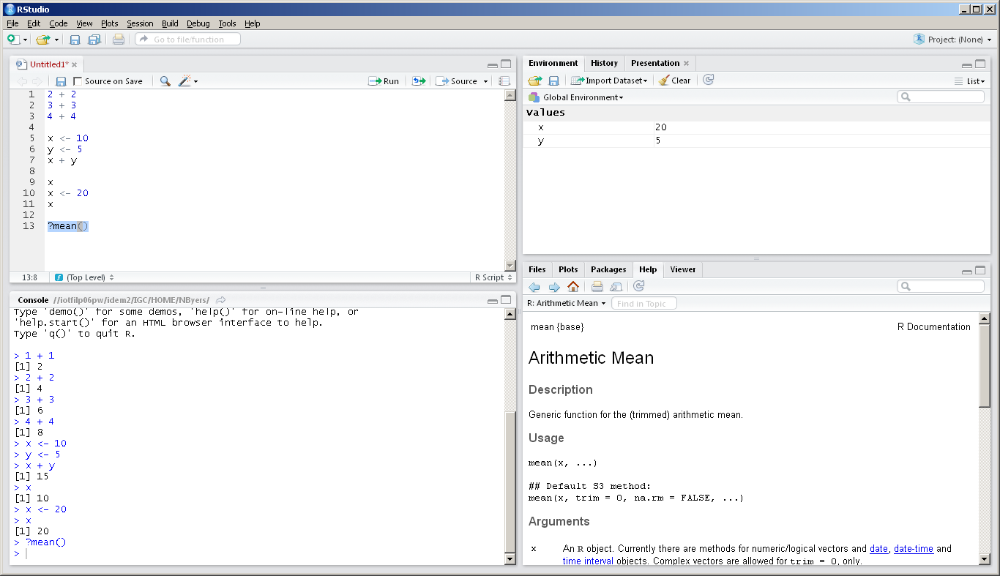
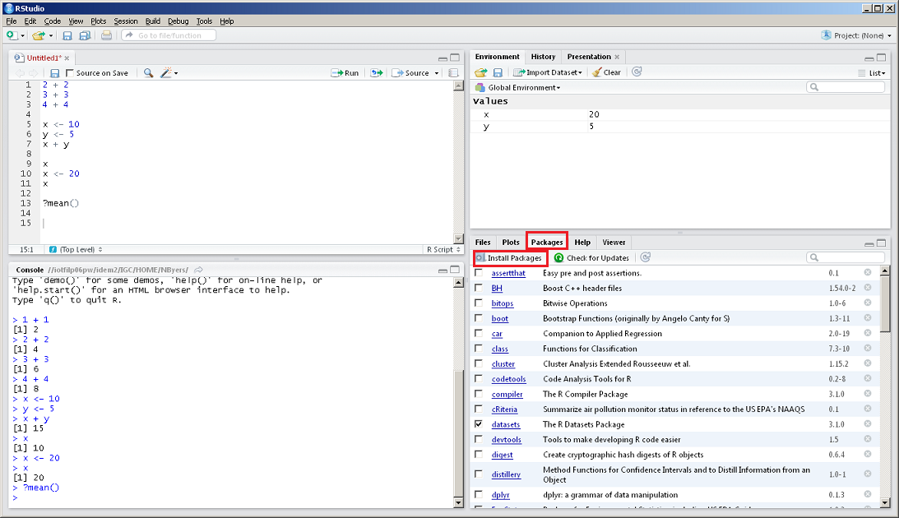
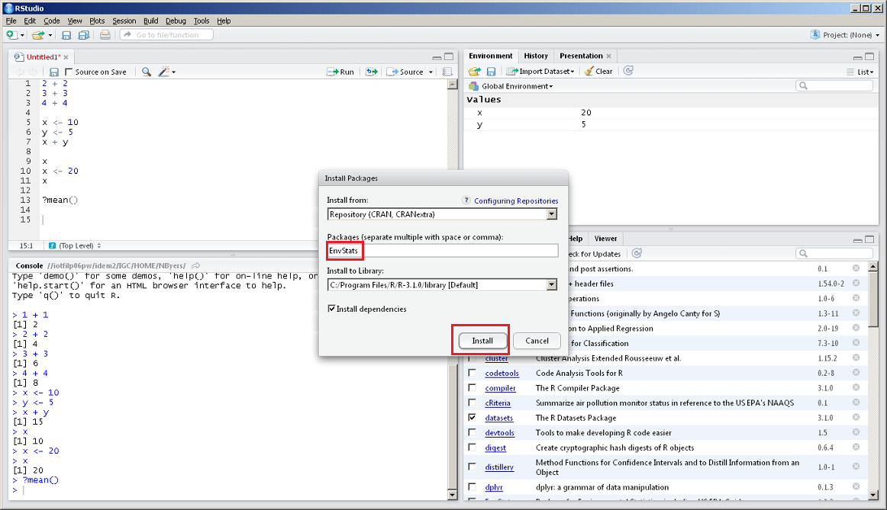

```{r setup, include=FALSE}
library(learnr)
library(gradethis)
library(trainingRIntro)
library(shiny)
```

This lesson covers the use of functions in R, including built-in functions and functions from packages. It also discusses how to import
data from CSV text files and Excel documents.

## Functions

In R, there are two main types of objects: variables and functions. We covered variables in the [introductory lesson](../1-Introduction-to-R/readme.md). A variable is used to create and reference data. The data can be a character, numeric, or logical data type. Variables can reference various "containers" for data, such as a __vector__, __list__, or __data frame__.


Functions are similar to variables in that they are short names that reference something saved in R. In this case, a function is not referencing data but a piece of code. A function is saved code that can be used to do some operation on data.


R has many built-in functions that perform common tasks. When you open RStudio you can immediately use a function called `mean( )`. Here is an example of using the `mean( )` function to find the average of a vector of integers. We first save a vector of integers in the `x` variable then put the variable inside the parentheses of the function.


```{r ex-PZ42S-1, exercise = TRUE, exercise.eval = FALSE, exercise.lines = 5, exercise.cap = 'Calculate Mean'}
x <- c(4, 8, 1, 14, 34)
mean(x)

```

As you would expect, R has many built-in math functions. Below are a series of examples.


```{r ex-Uh7Lj-2, exercise = TRUE, exercise.eval = FALSE, exercise.lines = 5, exercise.cap = 'Calculate Natural Logarithm'}
log(27)  #Natural logarithm

```

```{r ex-19pNl-3, exercise = TRUE, exercise.eval = FALSE, exercise.lines = 5, exercise.cap = 'Calculate Base 10 Logarithm'}
log10(100) #base 10 logarithm

```

```{r ex-vpdjU-4, exercise = TRUE, exercise.eval = FALSE, exercise.lines = 5, exercise.cap = 'Calculate Square Root'}
sqrt(225) # Square root

```

```{r ex-LOXSA-5, exercise = TRUE, exercise.eval = FALSE, exercise.lines = 5, exercise.cap = 'Calculate Absolute Value'}
abs(-5) #Absolute value

```

All of the examples show that the general form is `function_name( )`. The name of the function should give you some clue as to what it does, and the `( )` is where you provide the data to the function.


Many functions also have additional options you can choose, which are called the _arguments_. To see what needs to go inside `( )`, type a question mark in front of the function and run it in the R console.


```{r ex-WLoAZ-6, eval = FALSE}
?mean()

```

In RStudio, you will see the help page for `mean()` in the bottom right corner panel.




On the help page, under `Usage`, you see `mean(x, ...)`. This means that the only thing that necessarily has to go into `( )` is `x`. On the help page under `Arguments` you will find a description of what `x` needs to be: a numeric or logical vector.


Many built-in functions in R have multiple arguments. This allows you to give the function some more information to perform calculation you want. The example below shows how to use the `digits` argument in the `round( )` function. Providing different values to the `digits` argument will return different values.


```{r ex-24342-7, exercise = TRUE, exercise.eval = FALSE, exercise.lines = 5, exercise.cap = 'Round to Zero Digits'}
round(12.3456)

```

```{r ex-XpPTv-8, exercise = TRUE, exercise.eval = FALSE, exercise.lines = 5, exercise.cap = 'Round to Three Digits'}
round(12.3456, digits=3)

```

```{r ex-o0mwg-9, exercise = TRUE, exercise.eval = FALSE, exercise.lines = 5, exercise.cap = 'Round to One Digit'}
round(12.3456, digits=1)

```

## Useful Built-in Functions

When you start an R session there are many built-in functions that are immediately available for you to use. Other functions are available in community developed packages, as explained in a later section of this lesson. Below is a list of a few commonly used built-in functions in R.


### 1. `sum( )`

Returns the sum of a vector of numeric values.


```{r ex-xh7qy-1, exercise = TRUE, exercise.eval = FALSE, exercise.lines = 5, exercise.cap = 'Sum of Values'}
sum(c(2.3, 7.5, 9, -10))

```

### 2. `min()`

Get the minimum value from a numeric vector.


```{r ex-lG73s-1, exercise = TRUE, exercise.eval = FALSE, exercise.lines = 5, exercise.cap = 'Minimum Value'}
min(c(6, 9, 3, 11, -2))

```

### 3. `max()`

Get the maximum value from a numeric vector.


```{r ex-PXrqU-1, exercise = TRUE, exercise.eval = FALSE, exercise.lines = 5, exercise.cap = 'Maximum Value'}
max(c(6, 9, 3, 11, -2))

```

### 4. `seq()`

Create a numeric vector with a certain sequence. The example below creates a vector of integers from 1 to 5.


```{r ex-3hspm-1, exercise = TRUE, exercise.eval = FALSE, exercise.lines = 5, exercise.cap = 'Create Sequence with `seq()`'}
seq(from = 1, to = 5, by = 1)

```

Another way to create a sequence of integers is to use the colon.


```{r ex-VuXme-2, exercise = TRUE, exercise.eval = FALSE, exercise.lines = 5, exercise.cap = 'Create Sequence with Colon Operator'}
1:5

```

### 5. `paste()`

Concatenate two or more strings.


```{r ex-haMw9-1, exercise = TRUE, exercise.eval = FALSE, exercise.lines = 5, exercise.cap = 'Concatenate Strings'}
x <- "Hello"
y <- "world!"
paste(x, y, sep = " ")

```

Any numbers will be converted to strings.


```{r ex-Y3RRf-2, exercise = TRUE, exercise.eval = FALSE, exercise.lines = 5, exercise.cap = 'Concatenate Strings with Numbers'}
x <- "You're number "
y <- 1
z <- "!"
paste(x, y, z, sep = "")

```

### 6. `substr()`

The `substr()` function allows you to pull out a section from a string based on the position of the characters in the string. This is useful for vectors of dates, addresses, monitor IDs, parameter descriptions, etc.


For example, in AQS data a monitor ID may be written in the following format: [State code - County code - Site number - Parameter code - POC]. If we only wanted to pull out the site number for this monitor ID we could do the following:


```{r ex-Lj0Ba-1, exercise = TRUE, exercise.eval = FALSE, exercise.lines = 5, exercise.cap = 'Extract Site Number'}
wisconsin_monitor <- c('55-021-0015-44201-2')  # Ozone monitor in Columbia County, WI
site_id <- substr(wisconsin_monitor, start = 8, stop = 11)  # start and stop position within the character string.
site_id

```

## Nesting functions

R allows you to place a function inside another function to perform multiple tasks on data in one step.


For instance, if you want to create a sequence of numbers and then take the mean of that sequence, you could either do it in a couple of steps, or all at once.


```{r ex-Jm7g0-1, exercise = TRUE, exercise.eval = FALSE, exercise.lines = 5, exercise.cap = 'Calculate Mean in Two Steps'}
#Two steps
x <- seq(from=1, to=10, by=3)
mean(x)

```

```{r ex-32yHk-2, exercise = TRUE, exercise.eval = FALSE, exercise.lines = 5, exercise.cap = 'Calculate Mean in One Step'}
#One step
mean(seq(from=1, to=10, by=3))

```

_Note: Typically you don’t want to have too many nested functions because it becomes difficult to read._


## NA Values

Most of the statistical summary functions in R have the argument `na.rm`. This stands for `NA` remove. `NA` value is how R represents a missing value, similar to the NULL value in a SQL database.


For example, there is a built-in data frame in R called `airquality` with daily measurements from a monitor in New York from 1973 (see `?airquality`). If we load the data frame using the `data()` function and take a look at the top 6 rows using the `head()` function, we can see some missing values represented as `NA`.


```{r ex-fumGp-1, exercise = TRUE, exercise.eval = FALSE, exercise.lines = 5, exercise.cap = 'Inspect `airquality` Data'}
data("airquality")
head(airquality)

```

The `mean()` function, for example, has the argument `na.rm` set to `FALSE`. This means that the `NA` values will not be removed from the vector for which it is calculating the mean. As a result, it will return an `NA` because it cannot properly calculate the average. Here we use the `Ozone` column from the `airquality` data frame.


```{r ex-cBFjy-2, exercise = TRUE, exercise.eval = FALSE, exercise.lines = 5, exercise.cap = 'Mean with NA Values'}
mean(airquality$Ozone)

```

To get the mean value, we set `na.rm = TRUE`.


```{r ex-u9hgx-3, exercise = TRUE, exercise.eval = FALSE, exercise.lines = 5, exercise.cap = 'Mean with NA Removal'}
mean(airquality$Ozone, na.rm = TRUE)

```

## Packages

R comes with basic functionality, meaning that some functions will always be available when you start an R session. But anyone can write functions for R that are not part of the base functionality and make it available to other R users in a package.


Packages must be installed on your computer first then loaded before using it. This is similar to a mobile app: you must first install the R package (like first downloading an app) then you must load the package before using its functions (like opening an app to use it).


If base R doesn't have a function you need, the best thing to do is a Google search. Use a search with key words describing what you want the function to do and just add "R package" at the end.


For example, if you wanted to find serial correlation in an environmental data set, Google would tell you that the R package `EnvStats` has a function called `serialCorrelationTest()`.


First, you might try to use the function.


```{r ex-9Ceu9-1, error = TRUE}
x <- c(1.3, 3.5, 2.6, 3.4, 6.4)
serialCorrelationTest(x)

```

It's not available because we need to install the package first (again, like initially downloading an app).


In the bottom right panel of RStudio, click on the "Packages" tab then click "Install Packages" in the tool bar.




A window will pop up. Start typing "EnvStats" into the "Packages" box, select that package, and click "Install".




Now that we've installed the package, we still can't use the function we want. We need to load the package first (opening the app). We use the `library()` function to do this.


```{r ex-J1Mph-2, message = FALSE}
library(EnvStats)

```

```{r ex-Lp2yx-3, exercise = TRUE, exercise.eval = FALSE, exercise.cap = 'Use `serialCorrelationTest` from EnvStats'}
x <- c(1.3, 3.5, 2.6, 3.4, 6.4)
serialCorrelationTest(x)

```

Here is a link to a page that lists many useful packages for environmental data analysis: https://cran.r-project.org/web/views/Environmetrics.html


Remember, when you close down RStudio, then start it up again, you don’t have to download the package again. But you do have to load the package to use any function that's not in the R core functionality (this is very easy to forget).


## Importing Data

R can import data from just about any format, including CSV, Excel, Databases, GIS shapefiles. This section will demonstrate how to import CSV and Excel files.


### CSV

R has a built-in function called `read.csv()` for reading `.csv` files. Download the `chicago_daily.csv` file [here](../data/chicago_daily.csv) and save it to your working directory. If you don't know what your working directory is, run this code in R and it will tell you.


```{r ex-5hryX-1, eval = FALSE}
getwd()

```

Use `read.csv()` by providing the location and name of the file as the first argument. If the file is in your working directory, simply supply the name of the file. Below, the data from the file is read into R and saved as a data frame, which is the data type for storing tables. The function `head()` will show the first few lines.


```{r ex-3D7fZ-2, eval = FALSE}
chicago_daily <- read.csv("chicago_daily.csv")
head(chicago_daily)

```

### Excel

There are several packages that can be used to import data from an Excel file, such as `xlsx`, `XLConnect`, and `readxl`. In this example, we'll use the `readxl` package. If you do not have the package installed, you can use RStudio to install as described in the section above on packages. You can also use the function `install.packages( )`.


```{r ex-LHfSz-1, eval = FALSE}
install.packages("readxl")

```

Once you have the package installed, remember to load the package by using the `library()` function.


```r
library(readxl)

```

Use the `read_excel()` function from the `readxl` package to read emissions data from [this Excel workbook](./data/emissions_IL_2022.xlsx). Download the file to your working directory and read the first worksheet (named "UNIT_DATA"), skipping the first 6 rows.


```{r ex-evF30-3, exercise = TRUE, exercise.eval = FALSE, exercise.lines = 5, exercise.cap = 'Read and Inspect Excel Data'}
library(readxl)
emissions <- read_excel("./data/emissions_IL_2022.xlsx", sheet = "UNIT_DATA", skip = 6)
head(emissions)

```


## Exercises {data-progressive=TRUE}

### Exercise 1

Use the `seq()` function to create a vector from 1 to 20 by 2. For help with the parameters, run `?seq()` in the console and use the documentation.

```{r exercise1, exercise = TRUE}
# Your code here
```

```{r exercise1-hint-1}
# To create a sequence, use the `seq()` function with `from`, `to`, and `by` parameters.
```

```{r exercise1-hint-2}
# `from` specifies the starting number, `to` the ending number, and `by` how much to increment. For example, `seq(from = 1, to = 20, by = 2)`.
```

```{r exercise1-solution}
seq(from = 1, to = 20, by = 2)

```

```{r exercise1-check}
grade_this_code(
  correct = c(gradethis::random_praise(), "In the `seq()` function, set `by = 2` to increment the sequence by 2, starting from 1 and ending at 20. This creates a sequence of all odd numbers from 1 to 19. ")
)
```


### Exercise 2

Use the `round( )` to round the number 13.5678 to two digits after the decimal point.

```{r exercise2, exercise = TRUE}
# Your code here
```

```{r exercise2-hint-1}
# Use the `round()` function with the number as the first argument and the number of decimal places as the second argument.
```

```{r exercise2-hint-2}
# To round 13.5678 to two decimal places, use `round(13.5678, digits = 2)`.
```

```{r exercise2-solution}
round(13.5678, digits=2)

```

```{r exercise2-check}
grade_this_code(
  correct = c(gradethis::random_praise(), "Set the `digits` parameter to 2 in the `round()` function to round the number to two decimal places. This changes 13.5678 to 13.57. ")
)
```


### Exercise 3

Concatenate the strings "Hello" and "R" using the `paste()` function.

```{r exercise3, exercise = TRUE}
# Your code here
```

```{r exercise3-hint-1}
# Use the `paste()` function to combine two or more strings. The strings are separated by a space by default.
```

```{r exercise3-hint-2}
# For example, to concatenate "Hello" and "R", use `paste("Hello", "R")`.
```

```{r exercise3-solution}
paste("Hello", "R")

```

```{r exercise3-check}
grade_this_code(
  correct = c(gradethis::random_praise(), "Using the `paste()` function, we can concatenate "Hello" and "R" into a single string "Hello R". By default, `paste()` separates the strings with a space. ")
)
```


### Exercise 4

Sum the numbers 1 through 10 using the `sum()` function.

```{r exercise4, exercise = TRUE}
# Your code here
```

```{r exercise4-hint-1}
# Create a sequence of numbers using `:` operator. For example, `1:10` creates numbers from 1 to 10.
```

```{r exercise4-hint-2}
# Then, use the `sum()` function with the sequence to calculate the total sum.
```

```{r exercise4-solution}
sum(1:10)

```

```{r exercise4-check}
grade_this_code(
  correct = c(gradethis::random_praise(), "By using the `:` operator, we create a sequence of integers from 1 to 10. Placing this sequence inside the `sum()` function calculates the total sum of these numbers. ")
)
```


### Exercise 5

Read in the first 10 rows of the `chicago_daily.csv` file [here](../data/chicago_daily.csv).

```{r exercise5, exercise = TRUE}
# Your code here
```

```{r exercise5-hint-1}
# Use the `read.csv()` function to read in CSV files. Specify the file path and use `nrows` to limit the number of rows read.
```

```{r exercise5-hint-2}
# To read the first 10 rows, set `nrows = 10` in the `read.csv()` function.
```

```{r exercise5-solution}
read.csv("../data/chicago_daily.csv", nrows = 10)
```

```{r exercise5-check}
grade_this_code(
  correct = c(gradethis::random_praise(), "First, ensure the `chicago_daily.csv` file is saved in your working directory. Then, by using the `read.csv()` function with the `nrows` parameter set to 10, we can read only the first 10 rows of the file. ")
)
```


## Next Lesson


You have completed Lesson {lesson$no}. Click the button below to mark it as complete and move on to the next lesson.

```{r example-button, echo=FALSE}
  actionButton("complete_lesson", "Mark Lesson 2 Complete")
```


```{r, context = "server"}
  observeEvent(input$complete_lesson, {
    shiny::stopApp()
    trainingRIntro::set_user_state(lesson_2_complete=TRUE)
  })
```


