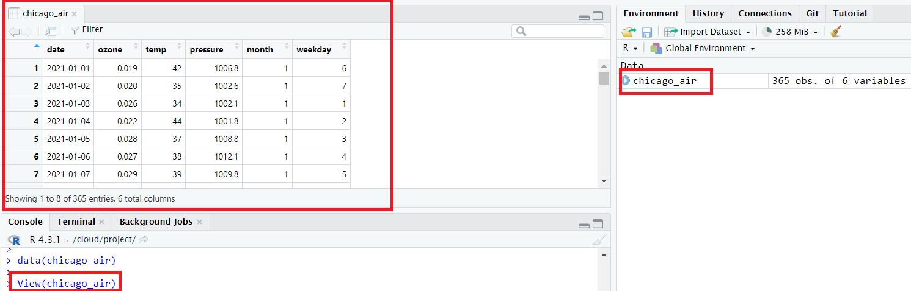

```{r setup, include=FALSE}
 library(learnr)
library(gradethis)
library(trainingRIntro)
library(shiny) 
```

This lesson covers how to subset data using indexing, logical operators, and the `filter()` function from `dplyr`. It also covers how to sort and combine data frames.

## Prerequisites

This lesson assumes you are familiar with the material in the previous
lesson on Functions and Importing Data.

The data from the R package region5air is used throughout these lessons.
To install the package from GitHub, use the `remotes` package. Run the code
below to install the `remotes` package and install `region5air` from GitHub.


```{r ex-fd067a5aae33, exercise = FALSE, exercise.eval = FALSE, eval = FALSE, exercise.cap = 'Install remotes and region5air'}
# if you have not installed remotes
install.packages("remotes")

library(remotes)
install_github("FluentData/region5air")

```

To load the chicago_air data frame we will be using in the lesson, use
the library() function to load the region5air package, then the data( ) function to load the data frame.


```{r ex-4a216e1191ae, exercise = FALSE, exercise.eval = FALSE, eval = FALSE, exercise.cap = 'Load `chicago_air` Data Frame'}
library(region5air)

data(chicago_air)

```

You should see the `chicago_air` variable in the top right panel of RStudio, which means the data frame has been loaded to your R session from this package.


We will also use some functions from the `dplyr` package. You will need to install the package if you haven't already.


```{r ex-919d8408eedd, exercise = FALSE, exercise.eval = FALSE, eval = FALSE, exercise.cap = 'Install `dplyr` Package'}
install.packages("dplyr")

```

## Viewing Data Frames

We always want to make sure our data looks the way it is supposed to before we begin working with it.


The best way to take a quick look at the first few rows of a data frame is to use the `head()` function.


```{r ex-4a054e277127, exercise = FALSE, exercise.eval = TRUE, exercise.cap = 'View the First Few Rows of `chicago_air`'}
data(chicago_air)
head(chicago_air)

```

You can specify the number of lines to display by using the `n` parameter.


```{r ex-22a7a0cfa07c, exercise = FALSE, exercise.eval = TRUE, exercise.cap = 'Specify Number of Lines with `head()`'}
head(chicago_air, n = 3)

```

You can also look at the bottom of the data frame by using the `tail()` function.


```{r ex-149e1239ea15, exercise = FALSE, exercise.eval = TRUE, exercise.cap = 'View the Last Few Rows of `chicago_air`'}
tail(chicago_air)

```

In RStudio, you can either click on the name of the data frame in the top right panel or use the `View()` function to generate a web based table of the data in the top left panel.


```{r ex-f94a8033655e, exercise = FALSE, exercise.eval = FALSE, eval = FALSE, exercise.cap = 'Use `View()` to Inspect `chicago_air`'}
View(chicago_air)

```



By inspecting the data frame this way, you can see that the records are daily values of ozone, temperature, and air pressure. For more information about the data set you can type a question mark in from the name of the data frame variable in the console.


```{r ex-2b529429ca7c, exercise = FALSE, exercise.eval = FALSE, eval = FALSE, exercise.cap = 'Learn More About `chicago_air`'}
?chicago_air

```

From the `Description` section of the help page, the `chicago_air` data frame is:

> A dataset containing daily values of ozone, temperature, and air pressure from a Chicago monitor between January 1, 2021 and December 31, 2021.


## Subsetting

If we want to work with a particular subset of a data frame, we need to know how to select those records. We will cover how to subset using numeric indexing, logical conditions, and the `filter()` function.


### Indexing

Values in a data frame can be selected, individually or in a group,
based on their index values. These are integers that represent the
locations in the data frame. If there is a 2 x 2 table, then there
are 2 rows and 2 columns. Each cell can be represented by two numbers,
like coordinates on a map. For a data frame, the format is `[row, column]`.
Below is a table that shows the index values in each cell.

|Column 1 | Column 2|
|---      |---      |
| `[1, 1]`| `[1, 2]`|
| `[2, 1]`| `[2, 2]`|


Below is a data frame called `my_data` that has 3 rows and 2 columns.


```{r ex-88a1bcff365b, exercise = FALSE, exercise.eval = TRUE, exercise.cap = 'Explore Data Frame Indexing with `my_data`'}
my_data <- data.frame(colors = c("red", "green", "yellow"),
                      fruit = c("apple", "grape", "banana"))

my_data

```

To select a particular cell from the `my_data` data frame, we use the `[row, column]` construction. We place those square brackets at the end of the data frame variable `my_data[]` and use integers to select a value. If we wanted to select the "green" value, we would use `my_data[2, 1]`.


```{r ex-58c2988d9de7, exercise = FALSE, exercise.eval = TRUE, exercise.cap = 'Select a Specific Value Using Indexing'}
my_data[2, 1]

```

To select "banana", we use `my_data[3, 2]`.


```{r ex-8384daae9beb, exercise = FALSE, exercise.eval = TRUE, exercise.cap = 'Access Another Specific Value Using Indexing'}
my_data[3, 2]

```

We can also access data from a vector using the same indexing idea. In this case, you don<U+2019>t need the comma to separate the rows and columns since you are accessing one dimensional data. Below is a vector of numbers.


```{r ex-81d6c088db05, exercise = FALSE, exercise.eval = TRUE, exercise.cap = 'Vector Indexing Example'}
x <- c(1, 3, 2, 7, 25.3, 6)
x

```

If we want to access the 5th element of the vector, we would use `x[5]`.


```{r ex-6954f2296a3b, exercise = FALSE, exercise.eval = TRUE, exercise.cap = 'Access a Vector Element by Index'}
x[5]

```

Now that we understand indexing we can subset the `chicago_air` data frame by using the brackets `[ , ]` function. (This is a rare example of a function in R that does not have the form `function_name()`.)


To get one row of the data frame, specify the row number you would like in the brackets, on the left side of the comma. If you leave   the column value on the right side of the comma blank, it returns all the columns associated with row number 1.


```{r ex-e5167c96f3c1, exercise = FALSE, exercise.eval = TRUE, exercise.cap = 'Subset `chicago_air` Data Frame Using Indexing'}
data(chicago_air)
chicago_air[1, ]

```

If you want more than one row, you can supply a vector of row numbers. Below, the vector access the 1st, 2nd, and 5th rows of the data frame.


```{r ex-524f12522db8, exercise = FALSE, exercise.eval = TRUE, exercise.cap = 'Access Multiple Rows with a Vector of Row Numbers'}
chicago_air[c(1, 2, 5), ]

```

To get a column from the data frame, specify the column number in the brackets, to the right of the comma. By leaving the row value blank, you are telling it to return all rows associated with column 1. Below, we wrap the output in the `head()` function to limit the number of rows printed.


```{r ex-bf66007d041a, exercise = FALSE, exercise.eval = TRUE, exercise.cap = 'Access a Single Column'}
head(chicago_air[, 1])

```

As you can see, a vector is returned. When a column of a data frame is selected a data frame is not returned. This is because a column in a data frame is all the same data type, and a vector is a simpler representation of the values. But if a row is selected, the values will not necessarily be the same data type, so a data frame is returned.


You can also obtain more than one column by supplying a vector of column numbers.


```{r ex-6c808511b98f, exercise = FALSE, exercise.eval = TRUE, exercise.cap = 'Access Multiple Columns'}
head(chicago_air[, c(3, 4, 6)])

```

Since more than one column is selected, then a data frame is returned.


A column name can be used to select a vector.


```{r ex-78d0d81fb271, exercise = FALSE, exercise.eval = TRUE, exercise.cap = 'Access a Column by Name'}
head(chicago_air[, "pressure"])

```

Or a vector of column names can subset to a slimmed down data frame.


```{r ex-1f0a718e93ab, exercise = FALSE, exercise.eval = TRUE, exercise.cap = 'Subset to Specific Columns by Name'}
head(chicago_air[, c("ozone", "temp", "month")])

```

Both rows and columns can be specified at the same time. The example below returns the first 5 rows of the temperature and pressure columns.


```{r ex-1b72dd331529, exercise = FALSE, exercise.eval = TRUE, exercise.cap = 'Specify Both Rows and Columns for Subsetting'}
chicago_air[1:5, c("temp", "pressure")]

```

### Access a Column with `$`

In R, the dollar sign `$` is a special character that can be used to access a data frame column by name. The dollar sign is placed immediately after the variable name. For example, if we wanted to access the temperature values in the `chicago_air` data frame, then we could use `chicago_air$temp`.


```{r ex-e100eb34c0a2, exercise = FALSE, exercise.eval = TRUE, exercise.cap = 'Access a Column with `$`'}
data(chicago_air)
head(chicago_air$temp)

```

Again, a vector is returned because a single column is being accessed. Using `$` is a convenient way to grab a column from a data frame, and we will use it throughout the rest of these lessons.


### Logical Expressions

It's useful to understand how numeric indexing works with data frames. But often, if we want a subset of data, we want to use a logical expression to keep data (or discard it).


Below is a table of logical operators in R that can be used to create logical conditions.


### Reference Table of Logical Operators
|Operator |Description |
| :---    | :---       |
| <	      | less than  |
| <=	    | less than or equal to|
| >	      | greater than |
| >=	    | greater than or equal to |
| ==	    | exactly equal to |
| !=	    | not equal to |
| !x      | not x |
| x & y   | x AND y |
| x | y   | x OR y|


The result of a logical expression is a logical data type, a boolean value `TRUE` or `FALSE`.


```{r ex-9f9caf18c58c, exercise = FALSE, exercise.eval = TRUE, exercise.cap = 'Logical Expressions Example 1'}
1 + 1 == 2

```

```{r ex-fc8d75060396, exercise = FALSE, exercise.eval = TRUE, exercise.cap = 'Logical Expressions Example 2'}
10 > 20

```

Vectors can also be used in a logical expression. A vector of values on the left hand side of a logical operator will return a vector of the same length with boolean values.


Here, we check if any of the integers in the vector on the left are above 60. A logical vector is returned.


```{r ex-59043580b7b2, exercise = FALSE, exercise.eval = TRUE, exercise.cap = 'Vector Logical Expression'}
c(25, 80, 55) > 60

```

This concept can be used to subset a data frame. A logical vector can be used in a similar way to an index vector in the brackets of a data frame `data_frame[rows, columns]`. Instead of providing a numeric vector that corresponds to row numbers, a logical vector that is as long as the data frame can be used to keep records (`TRUE`) and drop records (`FALSE`).


We can use the data frame of colors and fruit again to demonstrate.


```{r ex-a9b2e3099eab, exercise = FALSE, exercise.eval = TRUE, exercise.cap = 'Create a Logical Vector for Subsetting'}
my_data <- data.frame(colors = c("red", "green", "yellow"),
                      fruit = c("apple", "grape", "banana"))

my_data

```

If we only wanted records with the "yellow" color, we could use the vector `c(FALSE, FALSE, TRUE)`. Place this vector in the brackets of the data frame, where we select rows.


```{r ex-7b190a7a4839, exercise = FALSE, exercise.eval = TRUE, exercise.cap = 'Subset Using a Logical Vector'}
my_data[c(FALSE, FALSE, TRUE), ]

```

A data frame is returned. The only record is from the 3rd row of the logical vector, because that was the only `TRUE` value in the logical vector.


But a more useful way of creating the logical vector is with a logical expression. Below we access the "color" column as a vector using the `$` operator. Then we create a logical vector using a logical expression.


```{r ex-a9fd77ce528e, exercise = FALSE, exercise.eval = TRUE, exercise.cap = 'Create a Logical Vector with a Logical Expression'}
colors <- my_data$colors

colors

yellow <- colors == "yellow"

yellow

```

Now we can use the logical vector `yellow` to subset the data frame down to records that have the color yellow.


```{r ex-3cb1e0c4823e, exercise = FALSE, exercise.eval = TRUE, exercise.cap = 'Subset Data Frame Using Logical Vector'}
my_data[yellow, ]

```

The `chicago_air` data frame can be subset in a similar way. Below, a logical vector `hot` is created to represent hot days above 90 degrees. The data frame is subset down to records with hot days.


```{r ex-b7d8e57b9b8e, exercise = FALSE, exercise.eval = TRUE, exercise.cap = 'Subset `chicago_air` for Hot Days'}
hot <- chicago_air$temp > 90

chicago_air[hot, ]

```

### Subset with filter()

A logical vector can also be used in combination with the function `filter()`.


The `filter()` function is from a package called `dplyr` which provides many functions for manipulating data frames.


```{r ex-091d8c09adab, exercise = FALSE, exercise.eval = TRUE, exercise.cap = 'Load `dplyr` and Explore `filter()`'}
# if you have not installed dplyr


# install.packages("dplyr")

library(dplyr)

```

The benefit of using `filter()` is that it works the way other functions in R typically work. It used parentheses with parameters `( )`, and not brackets `[ , ]`. The first parameter is the data frame you want to subset, and the second parameter is a logical expression. It also allows you to reference the columns in the data frame by name, without having to access the column using `$`.


If we want to filter down to records in the `chicago_air` data frame where ozone was above 60 ppb (.060 ppm), we would use the following code.


```{r ex-5b39652a79c0, exercise = FALSE, exercise.eval = TRUE, exercise.cap = 'Filter `chicago_air` for High Ozone Levels'}
data(chicago_air)
high_ozone <- filter(chicago_air, ozone > 0.060)

high_ozone

```

If we wanted all of the high ozone days in the 6th month, we add another expression separated by a comma.


```{r ex-91eaac8d60b9, exercise = FALSE, exercise.eval = TRUE, exercise.cap = 'Filter for High Ozone Levels in June'}
data(chicago_air)
high_ozone_june <- filter(chicago_air, ozone > 0.060, month == 6)

high_ozone_june

```

Additional logical expressions can be added by separating each expression with a comma. The comma serves as a logical AND. Below is an equivalent output to the output above, using `&` instead of a comma.


```{r ex-0199db314ef1, exercise = FALSE, exercise.eval = TRUE, exercise.cap = 'Alternative `filter()` Syntax Using `&`'}
data(chicago_air)
high_ozone_june <- filter(chicago_air, ozone > 0.060 & month == 6)

high_ozone_june

```

## Sorting

The `dplyr` package also has a function named `arrange()` that will sort a data frame. It also takes a data frame as the first parameter. The output will be sorted by the column names that are provided as additional parameters.


Below, the `chicago_air` data frame is ordered by the `ozone` column. The default is ascending order.


```{r ex-43a0291f9d73, exercise = FALSE, exercise.eval = TRUE, exercise.cap = 'Sort `chicago_air` by `ozone`'}
# if the dplyr library is not already loaded
library(dplyr)
data(chicago_air)

ozone_ordered <- arrange(chicago_air, ozone)

head(ozone_ordered)

```

To use descending order, wrap the column in the `desc()` function (also from the `dplyr` package).


```{r ex-204b394f147e, exercise = FALSE, exercise.eval = TRUE, exercise.cap = 'Sort `chicago_air` in Descending Order by `ozone`'}
data(chicago_air)
ozone_descending <- arrange(chicago_air, desc(ozone))

head(ozone_descending)

```

Additional columns can be used to sort the data frame, separated by a comma.


```{r ex-c35c11523110, exercise = FALSE, exercise.eval = TRUE, exercise.cap = 'Sort `chicago_air` by Multiple Columns'}
data(chicago_air)
ozone_temp <- arrange(chicago_air, desc(ozone), desc(temp))

head(ozone_temp)

```

## Combining Data Frames

If we are working with multiple data frames in R, it is sometimes useful to combine two or more. The `dplyr` package has another convenient function called `bind_rows()` that will let you attach two data frames together that have the same columns.


To illustrate, we will make two subsets of the `chicago_air` data frame, then combine them together using the `bind_rows()` function. Below, the original number of records in the `chicago_air` data frame is shown using the `nrow()` function. We will split the data frame and recombine to a data frame with the original number of records.


```{r ex-89cd782b5084, exercise = FALSE, exercise.eval = TRUE, exercise.cap = 'Count Rows in `chicago_air`'}
# if you have not loaded the dplyr package
library(dplyr)
data(chicago_air)

nrow(chicago_air)

```

Now we split the data frame into warm and cool data frames using the `filter()` function.


```{r ex-b03ddf5134ca, exercise = FALSE, exercise.eval = TRUE, exercise.cap = 'Split `chicago_air` into Warm and Cool Subsets'}
data(chicago_air)

warm <- filter(chicago_air, temp > 80)

nrow(warm)

cool <- filter(chicago_air, temp <= 80) # get cool air records

nrow(cool)

```

We can confirm that the rows from these two data frames add up to the original data frame.


```{r ex-7bd6270abe78, exercise = FALSE, exercise.eval = TRUE, exercise.cap = 'Verify Row Counts Before Combining'}
nrow(warm) + nrow(cool) == nrow(chicago_air)

```

Now we combine using the `bind_rows()` function and confirm that the new `recombined` data frame has the same number of records as the original data frame.


```{r ex-f2a923140c36, exercise = FALSE, exercise.eval = TRUE, exercise.cap = 'Recombine Data Frames and Verify Row Count'}
data(chicago_air)

recombined <- bind_rows(warm, cool)

nrow(recombined) == nrow(chicago_air)

```


## Exercises {data-progressive=TRUE}

### Exercise 1

Load the `chicago_air` dataset from this package and display the first 10 rows of the dataset using the numeric index.

```{r exercise1, exercise = TRUE}
# Your code here
```

```{r exercise1-hint-1}
# Use the `data()` function to load datasets from packages. Use `data('chicago_air')` to load the `chicago_air` dataset.
```

```{r exercise1-hint-2}
# After loading the dataset, use `chicago_air[1:10, ]` to select the first 10 rows.
```

```{r exercise1-solution}
data("chicago_air")

chicago_air[1:10, ]

```

```{r exercise1-check}
grade_this_code(
  correct = c(gradethis::random_praise(), "Use the `data()` function to load the data frame into your R session and a vector from 1 to 10 in the first position of the brackets `[ , ]` to select the first 10 rows. This will allow you to work directly with the `chicago_air` dataset and easily access its initial rows for inspection. ")
)
```


### Exercise 2

Use the `filter()` function to subset the `chicago_air` data frame to values where ozone is above 0.060 ppm and the temperature is above 90 degrees.

```{r exercise2, exercise = TRUE}
# Your code here
```

```{r exercise2-hint-1}
# Make sure the `dplyr` package is loaded with `library(dplyr)` before using `filter()`.
```

```{r exercise2-hint-2}
# To filter for multiple conditions, separate each condition with a comma within the `filter()` function.
```

```{r exercise2-hint-3}
# Use `filter(chicago_air, ozone > 0.06, temp > 90)` to select rows meeting both conditions.
```

```{r exercise2-solution}
library(dplyr)
data(chicago_air)

filter(chicago_air, ozone > .06, temp > 90)

```

```{r exercise2-check}
grade_this_code(
  correct = c(gradethis::random_praise(), "Load the `dplyr` package using `library()` and use logical expressions to get records where `ozone` is greater than 0.06 and `temp` is greater than 90. This approach allows for targeted analysis on specific conditions of air quality and temperature within the `chicago_air` dataset, showcasing the power of the `dplyr` package for data manipulation. ")
)
```


### Exercise 3

Use the `arrange()` function to sort the `chicago_air` data frame in descending chronological order.

```{r exercise3, exercise = TRUE}
# Your code here
```

```{r exercise3-hint-1}
# Use `library(dplyr)` to load the package required for `arrange()`.
```

```{r exercise3-hint-2}
# The `desc()` function is used inside `arrange()` to sort a column in descending order. For example, `arrange(data, desc(column))`.
```

```{r exercise3-hint-3}
# To sort the `chicago_air` dataset by the `date` column in descending order, use `arrange(chicago_air, desc(date))`.
```

```{r exercise3-solution}
data(chicago_air)

descending <- arrange(chicago_air, desc(date))

head(descending)

```

```{r exercise3-check}
grade_this_code(
  correct = c(gradethis::random_praise(), "Wrap the `date` column in the `desc()` function to sort the `chicago_air` data frame in descending chronological order. This method is useful for analyzing the dataset from the most recent to the earliest date, allowing for an intuitive understanding of trends over time. ")
)
```


### Exercise 4

Create two data frames using the `data.frame()` function. The first data frame should have the columns `monitor_id` and `state` and at least one record. The second data frame should have the same column names and at least one record. Use the `dplyr` function `bind_rows()` to combine the two data frames.

```{r exercise4, exercise = TRUE}
# Your code here
```

```{r exercise4-solution}
library(dplyr)

monitors_1 <- data.frame(monitor_id = c(1, 2, 3), state = c("IL", "IN", "WI"))

monitors_2 <- data.frame(monitor_id = c(4, 5, 6), state = c("MI", "OH", "MN"))

bind_rows(monitors_1, monitors_2)
```

```{r exercise4-check}
grade_this_code(
  correct = c(gradethis::random_praise(), "")
)
```


## Next Lesson

You have completed Lesson . Click the button below to mark it as complete and move on to the next lesson.

```{r example-button, echo=FALSE}
  actionButton("complete_lesson", "Mark Lesson 3 Complete")
```


```{r, context = "server"}
observeEvent(input$complete_lesson, {
  showModal(modalDialog(
    title = 'Congratulations!',
tags$p("Great job navigating Subsetting, Sorting, and Combining Data Frames! You've successfully refined your data handling skills. Next, you'll dive into Writing Functions, Conditionals, and Loops to learn how to automate and streamline your data analysis processes.
"),
    easyClose = FALSE,
    footer = tagList(
      modalButton('Cancel'),
      actionButton('confirm_complete', 'Confirm', class = 'btn-primary')
    )
  ))
})

observeEvent(input$confirm_complete, {
  removeModal()
  trainingRIntro::set_user_state(lesson_3_complete=TRUE)
  shiny::stopApp()
})


